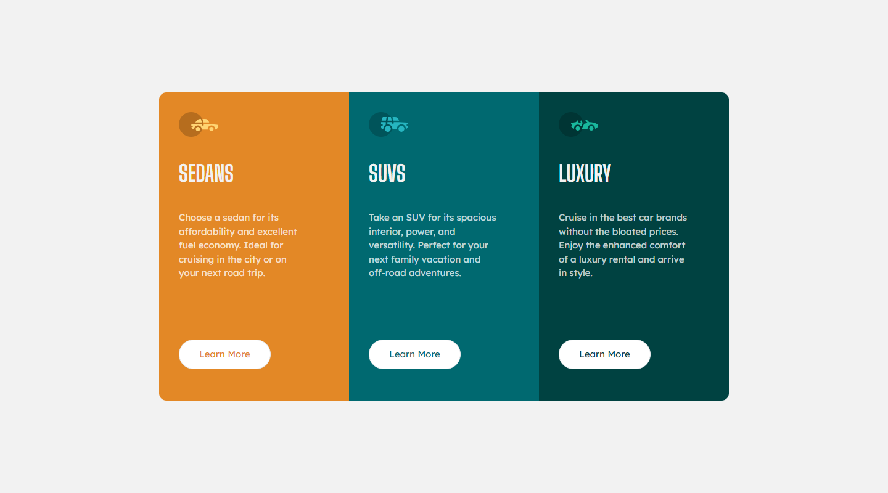

# Frontend Mentor - 3-column preview card component solution

This is a solution to the [3-column preview card component](https://www.frontendmentor.io/challenges/3column-preview-card-component-pH92eAR2-).

## Screenshot

## Links

- Solution URL: [here](https://www.frontendmentor.io/solutions/3columnpreviewcardcomponent-Jzc-suc25L)
- Live Site URL: [here](https://3-column-preview-card-component-peach-kappa.vercel.app/)

## Built with

- Semantic HTML5 markup
- Flexbox
- Mobile-first workflow
- [React](https://reactjs.org/) - JS frontend library
- [Vite js](https://vitejs.dev/) - Build tool
- [Tailwind](https://tailwindcss.com/) - For styles
